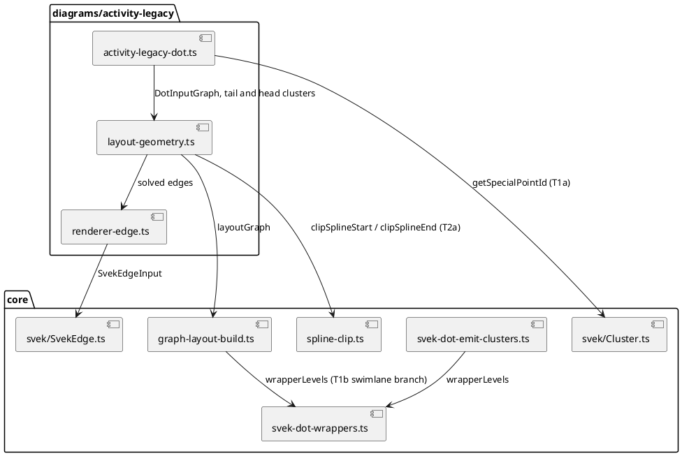

# Component map

```plantuml
@startuml
package "diagrams/activity-legacy" {
  [activity-legacy-dot.ts] as dot
  [layout-geometry.ts] as geo
  [renderer-edge.ts] as edge
}
package "core" {
  [svek/Cluster.ts] as cluster
  [svek-dot-wrappers.ts] as wrap
  [svek-dot-emit-clusters.ts] as emit
  [graph-layout-build.ts] as build
  [spline-clip.ts] as clip
  [svek/SvekEdge.ts] as svek
}
dot --> cluster : getSpecialPointId (T1a)
dot --> geo : DotInputGraph, tail and head clusters
geo --> build : layoutGraph
build --> wrap : wrapperLevels (T1b swimlane branch)
emit --> wrap : wrapperLevels
geo --> clip : clipSplineStart / clipSplineEnd (T2a)
geo --> edge : solved edges
edge --> svek : SvekEdgeInput
@enduml
```
