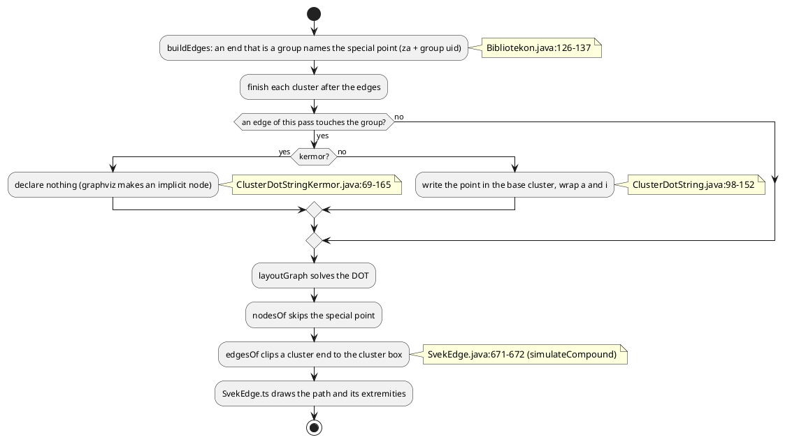

# Data flow: a link to a partition, after the mission

```plantuml
@startuml
start
:buildEdges: an end that is a group names the special point (za + group uid);
note right: Bibliotekon.java:126-137
:finish each cluster after the edges;
if (an edge of this pass touches the group?) then (yes)
  if (kermor?) then (yes)
    :declare nothing (graphviz makes an implicit node);
    note right: ClusterDotStringKermor.java:69-165
  else (no)
    :write the point in the base cluster, wrap a and i;
    note right: ClusterDotString.java:98-152
  endif
else (no)
endif
:layoutGraph solves the DOT;
:nodesOf skips the special point;
:edgesOf clips a cluster end to the cluster box;
note right: SvekEdge.java:671-672 (simulateCompound)
:SvekEdge.ts draws the path and its extremities;
stop
@enduml
```
