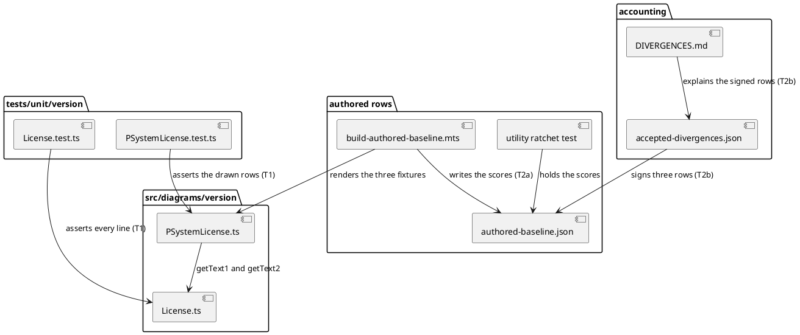

# Component map

Which file each task writes, and what reads it.

```plantuml
@startuml
package "src/diagrams/version" {
  [License.ts] as License
  [PSystemLicense.ts] as Page
}
package "tests/unit/version" {
  [License.test.ts] as LT
  [PSystemLicense.test.ts] as PT
}
package "authored rows" {
  [build-authored-baseline.mts] as Tool
  [authored-baseline.json] as Baseline
  [utility ratchet test] as Ratchet
}
package "accounting" {
  [accepted-divergences.json] as Ledger
  [DIVERGENCES.md] as Div
}
Page --> License : getText1 and getText2
LT --> License : asserts every line (T1)
PT --> Page : asserts the drawn rows (T1)
Tool --> Page : renders the three fixtures
Tool --> Baseline : writes the scores (T2a)
Ratchet --> Baseline : holds the scores
Ledger --> Baseline : signs three rows (T2b)
Div --> Ledger : explains the signed rows (T2b)
@enduml
```
