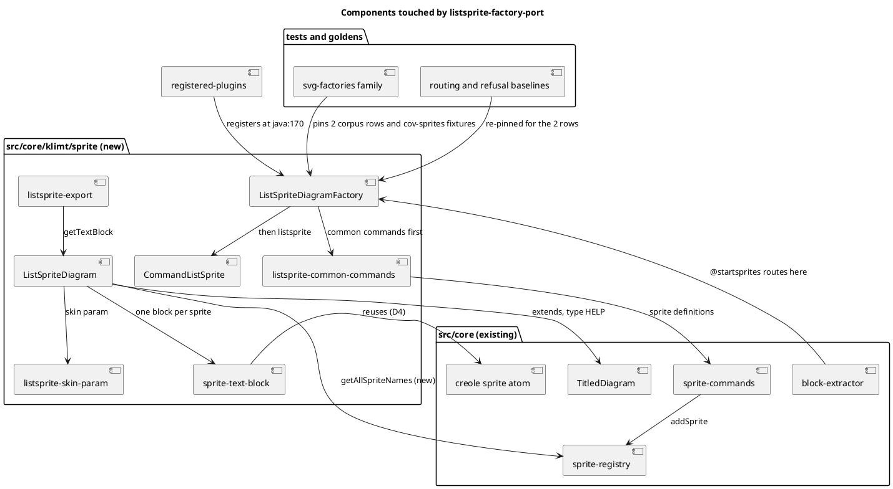

# Component map

New files in `src/core/klimt/sprite/` and the existing pieces they reuse. Rendered with `scripts/oracle-render.sh` at planning.

```plantuml
@startuml
title Components touched by listsprite-factory-port
package "src/core/klimt/sprite (new)" {
  [ListSpriteDiagramFactory] as F
  [CommandListSprite] as C
  [listsprite-common-commands] as CC
  [listsprite-skin-param] as SP
  [ListSpriteDiagram] as L
  [sprite-text-block] as STB
  [listsprite-export] as E
}
package "src/core (existing)" {
  [sprite-registry] as REG
  [sprite-commands] as SC
  [creole sprite atom] as ATOM
  [TitledDiagram] as TD
  [block-extractor] as BX
}
[registered-plugins] as RP
package "tests and goldens" {
  [svg-factories family] as FAM
  [routing and refusal baselines] as RB
}
RP --> F : registers at java:170
BX --> F : @startsprites routes here
F --> CC : common commands first
F --> C : then listsprite
CC --> SC : sprite definitions
SC --> REG : addSprite
L --> TD : extends, type HELP
L --> SP : skin param
L --> REG : getAllSpriteNames (new)
L --> STB : one block per sprite
STB --> ATOM : reuses (D4)
E --> L : getTextBlock
FAM --> F : pins 2 corpus rows and cov-sprites fixtures
RB --> F : re-pinned for the 2 rows
@enduml
```
