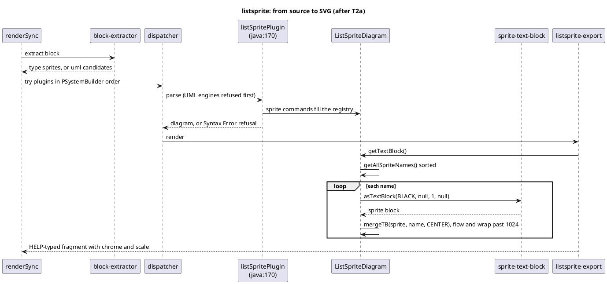

# Data flow

How a `listsprite` source reaches the SVG once T2a registers the plugin. Rendered with `scripts/oracle-render.sh` at planning.

```plantuml
@startuml
title listsprite: from source to SVG (after T2a)
participant "renderSync" as R
participant "block-extractor" as B
participant "dispatcher" as D
participant "listSpritePlugin\n(java:170)" as P
participant "ListSpriteDiagram" as L
participant "sprite-text-block" as S
participant "listsprite-export" as E
R -> B : extract block
B --> R : type sprites, or uml candidates
R -> D : try plugins in PSystemBuilder order
D -> P : parse (UML engines refused first)
P -> L : sprite commands fill the registry
P --> D : diagram, or Syntax Error refusal
D -> E : render
E -> L : getTextBlock()
L -> L : getAllSpriteNames() sorted
loop each name
  L -> S : asTextBlock(BLACK, null, 1, null)
  S --> L : sprite block
  L -> L : mergeTB(sprite, name, CENTER), flow and wrap past 1024
end
E --> R : HELP-typed fragment with chrome and scale
@enduml
```
