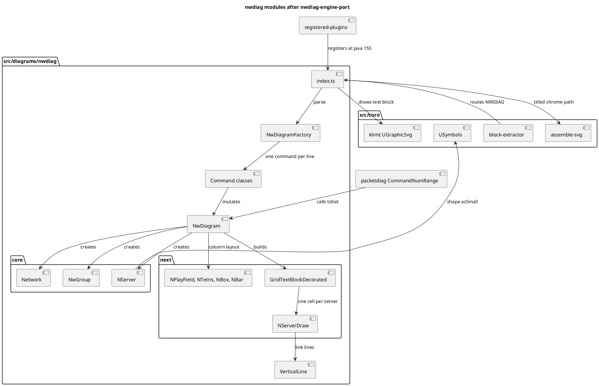

# Component map

The nwdiag modules after the port and the shared seams they touch (D1 to D3, D7).

```plantuml
@startuml
title nwdiag modules after nwdiag-engine-port
package "src/diagrams/nwdiag" {
  [index.ts] as idx
  [NwDiagramFactory] as fac
  [Command classes] as cmd
  [NwDiagram] as dia
  package "core" {
    [NServer] as srv
    [Network] as net
    [NwGroup] as grp
  }
  package "next" {
    [NPlayField, NTetris, NBox, NBar] as lay
    [GridTextBlockDecorated] as grid
    [NServerDraw] as draw
  }
  [VerticalLine] as vl
}
package "src/core" {
  [block-extractor] as be
  [assemble-svg] as as
  [USymbols] as sym
  [klimt UGraphicSvg] as ug
}
[registered-plugins] as reg
[packetdiag CommandNumRange] as pkt
reg --> idx : registers at java 155
be --> idx : routes NWDIAG
idx --> fac : parse
fac --> cmd : one command per line
cmd --> dia : mutates
dia --> srv : creates
dia --> net : creates
dia --> grp : creates
dia --> lay : column layout
dia --> grid : builds
grid --> draw : one cell per server
draw --> vl : link lines
srv --> sym : shape asSmall
idx --> ug : draws text block
idx --> as : titled chrome path
pkt --> dia : calls toSet
@enduml
```
