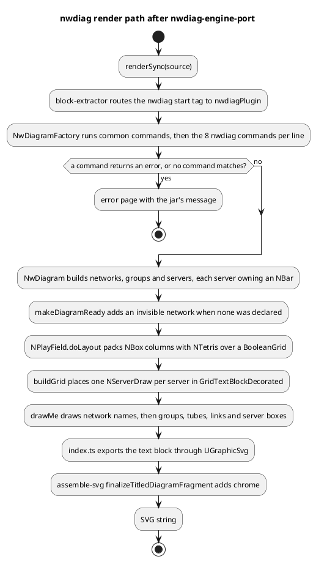

# Data flow

How an nwdiag source becomes SVG after the port (D1, D2).

```plantuml
@startuml
title nwdiag render path after nwdiag-engine-port
start
:renderSync(source);
:block-extractor routes the nwdiag start tag to nwdiagPlugin;
:NwDiagramFactory runs common commands, then the 8 nwdiag commands per line;
if (a command returns an error, or no command matches?) then (yes)
  :error page with the jar's message;
  stop
else (no)
endif
:NwDiagram builds networks, groups and servers, each server owning an NBar;
:makeDiagramReady adds an invisible network when none was declared;
:NPlayField.doLayout packs NBox columns with NTetris over a BooleanGrid;
:buildGrid places one NServerDraw per server in GridTextBlockDecorated;
:drawMe draws network names, then groups, tubes, links and server boxes;
:index.ts exports the text block through UGraphicSvg;
:assemble-svg finalizeTitledDiagramFragment adds chrome;
:SVG string;
stop
@enduml
```
