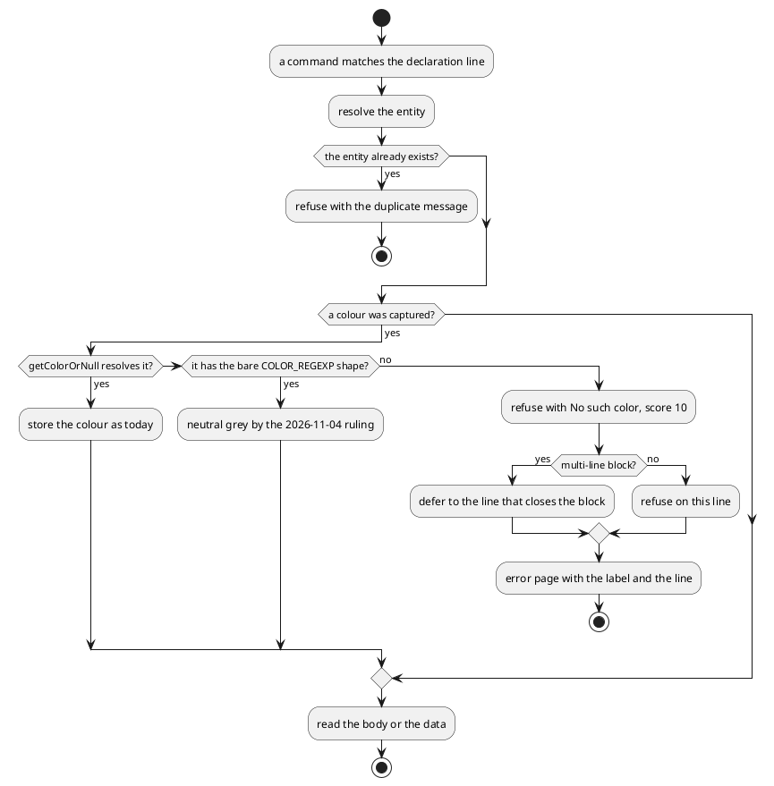

# Data flow: one object or json declaration after T2 and T3

```plantuml
@startuml
start
:a command matches the declaration line;
:resolve the entity;
if (the entity already exists?) then (yes)
  :refuse with the duplicate message;
  stop
endif
if (a colour was captured?) then (yes)
  if (getColorOrNull resolves it?) then (yes)
    :store the colour as today;
  elseif (it has the bare COLOR_REGEXP shape?) then (yes)
    :neutral grey by the 2026-11-04 ruling;
  else (no)
    :refuse with No such color, score 10;
    if (multi-line block?) then (yes)
      :defer to the line that closes the block;
    else (no)
      :refuse on this line;
    endif
    :error page with the label and the line;
    stop
  endif
endif
:read the body or the data;
stop
@enduml
```
