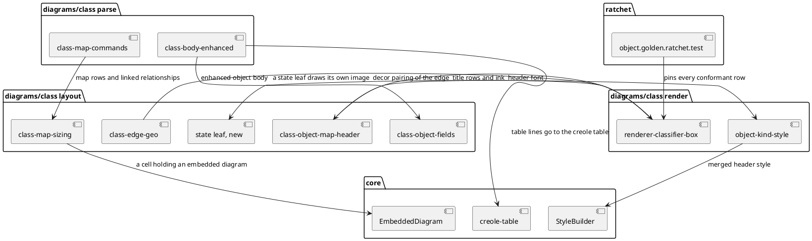

# Components touched

```plantuml
@startuml
package "diagrams/class parse" {
  [class-map-commands] as mapc
  [class-body-enhanced] as body
}
package "diagrams/class layout" {
  [class-map-sizing] as maps
  [class-object-map-header] as hdr
  [class-object-fields] as fields
  [class-edge-geo] as geo
  [state leaf, new] as state
}
package "diagrams/class render" {
  [object-kind-style] as oks
  [renderer-classifier-box] as box
}
package "core" {
  [StyleBuilder] as sb
  [EmbeddedDiagram] as emb
  [creole-table] as table
}
package "ratchet" {
  [object.golden.ratchet.test] as rat
}
mapc --> maps : map rows and linked relationships
body --> table : table lines go to the creole table
body --> fields : enhanced object body
maps --> emb : a cell holding an embedded diagram
oks --> sb : merged header style
hdr --> oks : header font
box --> hdr : title rows and ink
box --> state : a state leaf draws its own image
geo --> box : decor pairing of the edge
rat --> box : pins every conformant row
@enduml
```
