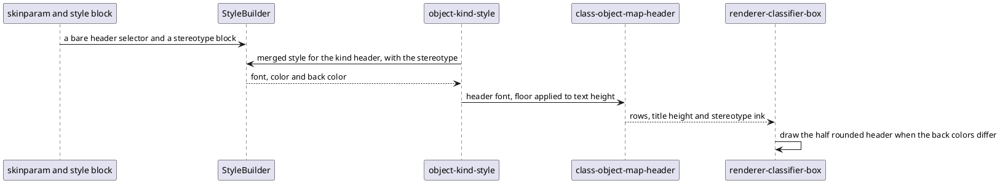
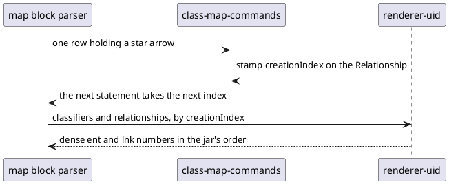

# Data flow: where an object header's style comes from (D3)

```plantuml
@startuml
participant "skinparam and style block" as src
participant "StyleBuilder" as sb
participant "object-kind-style" as oks
participant "class-object-map-header" as hdr
participant "renderer-classifier-box" as box
src -> sb : a bare header selector and a stereotype block
oks -> sb : merged style for the kind header, with the stereotype
sb --> oks : font, color and back color
oks -> hdr : header font, floor applied to text height
hdr --> box : rows, title height and stereotype ink
box -> box : draw the half rounded header when the back colors differ
@enduml
```

# Data flow: a linked map row's uid (D2)

```plantuml
@startuml
participant "map block parser" as map
participant "class-map-commands" as cmd
participant "renderer-uid" as uid
map -> cmd : one row holding a star arrow
cmd -> cmd : stamp creationIndex on the Relationship
cmd --> map : the next statement takes the next index
map -> uid : classifiers and relationships, by creationIndex
uid --> map : dense ent and lnk numbers in the jar's order
@enduml
```
