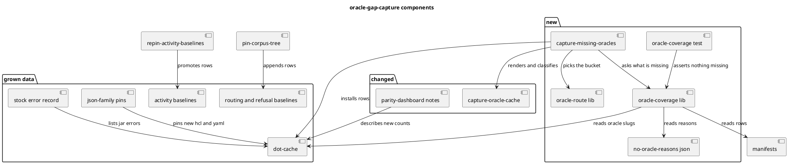

# Component map — what this mission touches (proposed)

`src/` is out of bounds. Every component here is a script, a test or committed data.

```plantuml
@startuml
title oracle-gap-capture components
package "new" {
  [oracle-coverage lib] as COV
  [oracle-route lib] as ROUTE
  [capture-missing-oracles] as CMO
  [oracle-coverage test] as COVT
  [no-oracle-reasons json] as REASONS
}
package "changed" {
  [capture-oracle-cache] as COC
  [parity-dashboard notes] as NOTES
}
package "grown data" {
  [dot-cache] as CACHE
  [routing and refusal baselines] as RB
  [activity baselines] as AB
  [json-family pins] as JF
  [stock error record] as STOCK
}
[manifests] as MAN
[pin-corpus-tree] as PIN
[repin-activity-baselines] as REPIN

CMO --> COV : asks what is missing
CMO --> ROUTE : picks the bucket
CMO --> COC : renders and classifies
CMO --> CACHE : installs rows
COV --> MAN : reads rows
COV --> CACHE : reads oracle slugs
COV --> REASONS : reads reasons
COVT --> COV : asserts nothing missing
PIN --> RB : appends rows
REPIN --> AB : promotes rows
NOTES --> CACHE : describes new counts
STOCK --> CACHE : lists jar errors
JF --> CACHE : pins new hcl and yaml
@enduml
```
