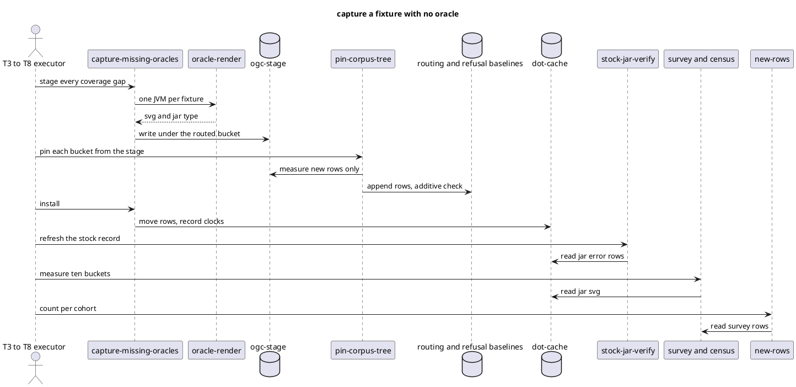

# Data flow — from a gap to a measured row (proposed)

The stage exists because the pin tool appends every fixture in its tree, so it must see only new rows.

```plantuml
@startuml
title capture a fixture with no oracle
actor "T3 to T8 executor" as EX
participant "capture-missing-oracles" as CM
participant "oracle-render" as OR
database "ogc-stage" as ST
participant "pin-corpus-tree" as PT
database "routing and refusal baselines" as RB
database "dot-cache" as CA
participant "stock-jar-verify" as SV
participant "survey and census" as SU
participant "new-rows" as NR

EX -> CM : stage every coverage gap
CM -> OR : one JVM per fixture
OR --> CM : svg and jar type
CM -> ST : write under the routed bucket
EX -> PT : pin each bucket from the stage
PT -> ST : measure new rows only
PT -> RB : append rows, additive check
EX -> CM : install
CM -> CA : move rows, record clocks
EX -> SV : refresh the stock record
SV -> CA : read jar error rows
EX -> SU : measure ten buckets
SU -> CA : read jar svg
EX -> NR : count per cohort
NR -> SU : read survey rows
@enduml
```
