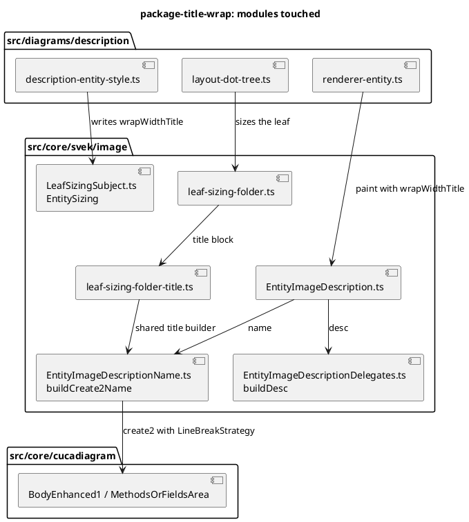

# Component map

The modules this mission touches and the calls between them. Parsed with `scripts/oracle-render.sh` at planning.

```plantuml
@startuml
title package-title-wrap: modules touched
package "src/diagrams/description" {
  [description-entity-style.ts] as DES
  [renderer-entity.ts] as RE
  [layout-dot-tree.ts] as LDT
}
package "src/core/svek/image" {
  [LeafSizingSubject.ts\nEntitySizing] as LSS
  [leaf-sizing-folder.ts] as LSF
  [leaf-sizing-folder-title.ts] as LSFT
  [EntityImageDescription.ts] as EID
  [EntityImageDescriptionName.ts\nbuildCreate2Name] as EIDN
  [EntityImageDescriptionDelegates.ts\nbuildDesc] as EIDD
}
package "src/core/cucadiagram" {
  [BodyEnhanced1 / MethodsOrFieldsArea] as BE1
}
DES --> LSS : writes wrapWidthTitle
LDT --> LSF : sizes the leaf
LSF --> LSFT : title block
LSFT --> EIDN : shared title builder
RE --> EID : paint with wrapWidthTitle
EID --> EIDN : name
EID --> EIDD : desc
EIDN --> BE1 : create2 with LineBreakStrategy
@enduml
```
