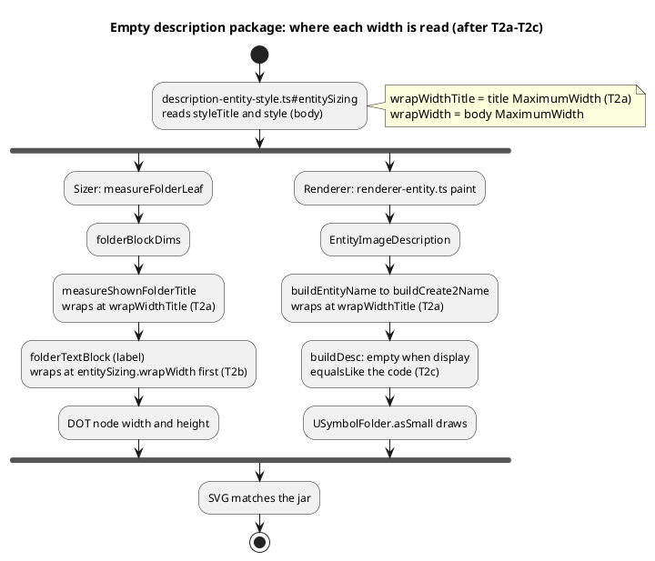

# Data flow

Where each wrap width is read for an empty description `package`, once T2a to T2c land. Parsed with
`scripts/oracle-render.sh` at planning.

```plantuml
@startuml
title Empty description package: where each width is read (after T2a-T2c)
start
:description-entity-style.ts#entitySizing
reads styleTitle and style (body);
note right
  wrapWidthTitle = title MaximumWidth (T2a)
  wrapWidth = body MaximumWidth
end note
fork
  :Sizer: measureFolderLeaf;
  :folderBlockDims;
  :measureShownFolderTitle
  wraps at wrapWidthTitle (T2a);
  :folderTextBlock (label)
  wraps at entitySizing.wrapWidth first (T2b);
  :DOT node width and height;
fork again
  :Renderer: renderer-entity.ts paint;
  :EntityImageDescription;
  :buildEntityName to buildCreate2Name
  wraps at wrapWidthTitle (T2a);
  :buildDesc: empty when display
  equalsLike the code (T2c);
  :USymbolFolder.asSmall draws;
end fork
:SVG matches the jar;
stop
@enduml
```
