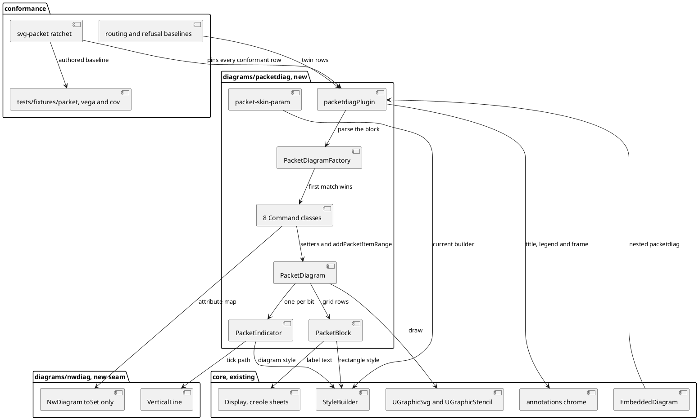

# Components touched

```plantuml
@startuml
package "diagrams/packetdiag, new" {
  [PacketDiagramFactory] as factory
  [8 Command classes] as commands
  [PacketDiagram] as diagram
  [PacketBlock] as block
  [PacketIndicator] as ind
  [packet-skin-param] as skin
  [packetdiagPlugin] as plugin
}
package "diagrams/nwdiag, new seam" {
  [VerticalLine] as vline
  [NwDiagram toSet only] as nw
}
package "core, existing" {
  [StyleBuilder] as sb
  [Display, creole sheets] as display
  [UGraphicSvg and UGraphicStencil] as ug
  [annotations chrome] as chrome
  [EmbeddedDiagram] as embed
}
package "conformance" {
  [svg-packet ratchet] as rat
  [routing and refusal baselines] as gates
  [tests/fixtures/packet, vega and cov] as fx
}
plugin --> factory : parse the block
factory --> commands : first match wins
commands --> diagram : setters and addPacketItemRange
commands --> nw : attribute map
diagram --> block : grid rows
diagram --> ind : one per bit
ind --> vline : tick path
block --> display : label text
block --> sb : rectangle style
ind --> sb : diagram style
skin --> sb : current builder
diagram --> ug : draw
plugin --> chrome : title, legend and frame
embed --> plugin : nested packetdiag
rat --> plugin : pins every conformant row
rat --> fx : authored baseline
gates --> plugin : twin rows
@enduml
```
