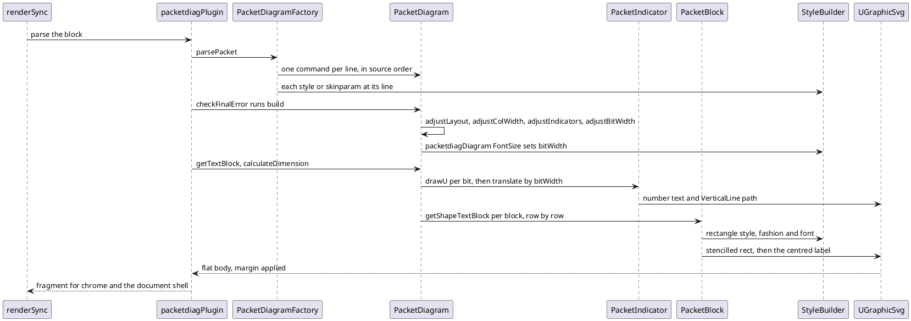
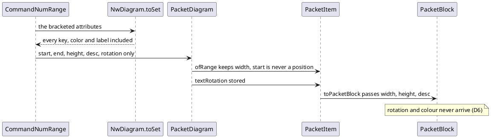

# Data flow: one packet diagram through the new engine

```plantuml
@startuml
participant "renderSync" as sync
participant "packetdiagPlugin" as plugin
participant "PacketDiagramFactory" as factory
participant "PacketDiagram" as diagram
participant "PacketIndicator" as ind
participant "PacketBlock" as block
participant "StyleBuilder" as sb
participant "UGraphicSvg" as ug
sync -> plugin : parse the block
plugin -> factory : parsePacket
factory -> diagram : one command per line, in source order
factory -> sb : each style or skinparam at its line
plugin -> diagram : checkFinalError runs build
diagram -> diagram : adjustLayout, adjustColWidth, adjustIndicators, adjustBitWidth
diagram -> sb : packetdiagDiagram FontSize sets bitWidth
plugin -> diagram : getTextBlock, calculateDimension
diagram -> ind : drawU per bit, then translate by bitWidth
ind -> ug : number text and VerticalLine path
diagram -> block : getShapeTextBlock per block, row by row
block -> sb : rectangle style, fashion and font
block -> ug : stencilled rect, then the centred label
ug --> plugin : flat body, margin applied
plugin --> sync : fragment for chrome and the document shell
@enduml
```

# Data flow: what the jar drops

```plantuml
@startuml
participant "CommandNumRange" as cmd
participant "NwDiagram.toSet" as toset
participant "PacketDiagram" as diagram
participant "PacketItem" as item
participant "PacketBlock" as block
cmd -> toset : the bracketed attributes
toset --> cmd : every key, color and label included
cmd -> diagram : start, end, height, desc, rotation only
diagram -> item : ofRange keeps width, start is never a position
diagram -> item : textRotation stored
item -> block : toPacketBlock passes width, height, desc
note over block : rotation and colour never arrive (D6)
@enduml
```
