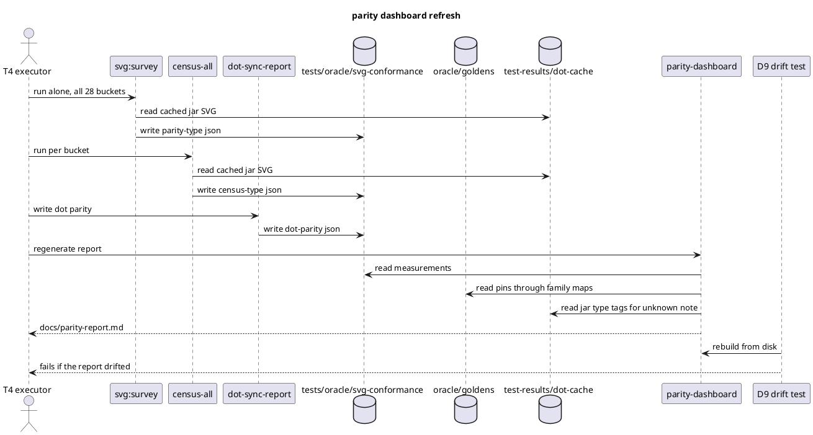

# Data flow — from producers to the page (proposed)

Only the dashboard script and `docs/parity-report.md` are read by humans. Producers run
by hand, and the drift gate checks the result.

```plantuml
@startuml
title parity dashboard refresh
actor "T4 executor" as EX
participant "svg:survey" as SV
participant "census-all" as CE
participant "dot-sync-report" as DO
database "tests/oracle/svg-conformance" as JS
database "oracle/goldens" as GO
database "test-results/dot-cache" as CA
participant "parity-dashboard" as PD
participant "D9 drift test" as D9

EX -> SV : run alone, all 28 buckets
SV -> CA : read cached jar SVG
SV -> JS : write parity-type json
EX -> CE : run per bucket
CE -> CA : read cached jar SVG
CE -> JS : write census-type json
EX -> DO : write dot parity
DO -> JS : write dot-parity json
EX -> PD : regenerate report
PD -> JS : read measurements
PD -> GO : read pins through family maps
PD -> CA : read jar type tags for unknown note
PD --> EX : docs/parity-report.md
D9 -> PD : rebuild from disk
D9 --> EX : fails if the report drifted
@enduml
```
