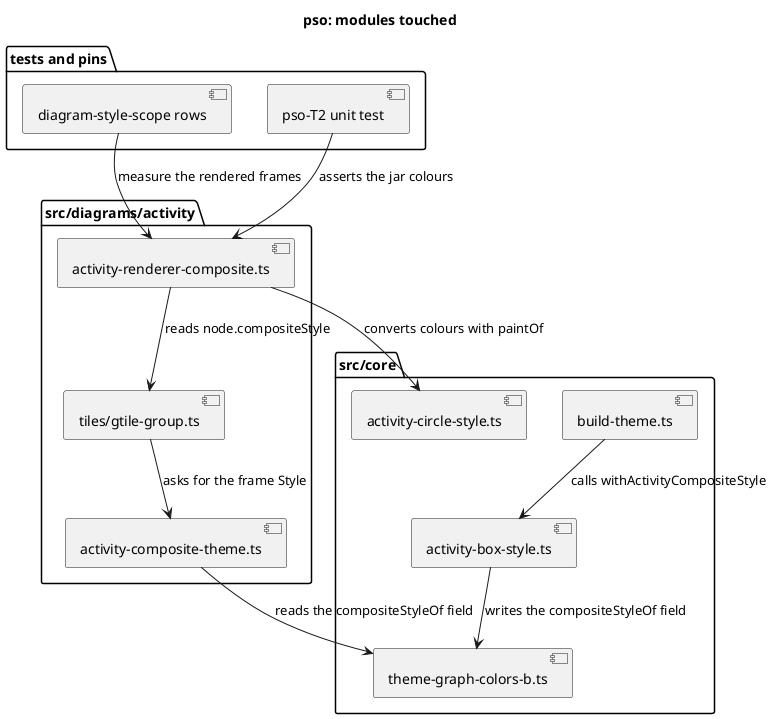

# Component map

The modules T2 touches, and the rows that measure them. Rendered with `scripts/oracle-render.sh` at planning; it parses.

```plantuml
@startuml
title pso: modules touched
package "src/core" {
  [activity-box-style.ts] as ABS
  [theme-graph-colors-b.ts] as TG
  [build-theme.ts] as BT
  [activity-circle-style.ts] as ACS
}
package "src/diagrams/activity" {
  [activity-composite-theme.ts] as ACT
  [tiles/gtile-group.ts] as GG
  [activity-renderer-composite.ts] as ARC
}
package "tests and pins" {
  [diagram-style-scope rows] as ROWS
  [pso-T2 unit test] as UT
}
BT --> ABS : calls withActivityCompositeStyle
ABS --> TG : writes the compositeStyleOf field
ACT --> TG : reads the compositeStyleOf field
GG --> ACT : asks for the frame Style
ARC --> ACS : converts colours with paintOf
ARC --> GG : reads node.compositeStyle
ROWS --> ARC : measure the rendered frames
UT --> ARC : asserts the jar colours
@enduml
```
