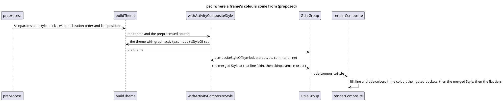

# Data flow

How an activity frame's colours are resolved after T2. Rendered with `scripts/oracle-render.sh` at planning; it parses.

```plantuml
@startuml
title pso: where a frame's colours come from (proposed)
participant "preprocess" as P
participant "buildTheme" as B
participant "withActivityCompositeStyle" as W
participant "GtileGroup" as G
participant "renderComposite" as R
P -> B : skinparams and style blocks, with declaration order and line positions
B -> W : the theme and the preprocessed source
W -> B : the theme with graph.activity.compositeStyleOf set
B -> G : the theme
G -> W : compositeStyleOf(symbol, stereotype, command line)
W --> G : the merged Style at that line (skin, then skinparams in order)
G -> R : node.compositeStyle
R -> R : fill, line and title colour: inline colour, then gated buckets, then the merged Style, then the flat tiers
@enduml
```
