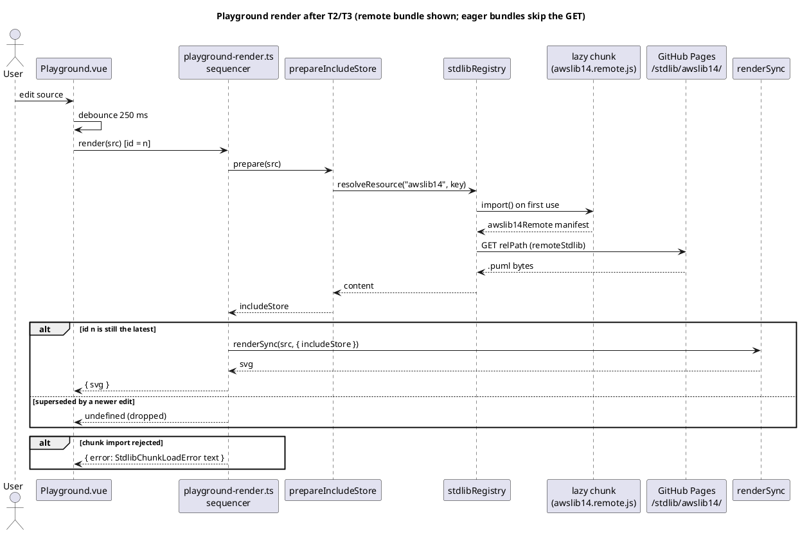

# Data flow: one playground render with a stdlib include

```plantuml
@startuml
title Playground render after T2/T3 (remote bundle shown; eager bundles skip the GET)
actor User
participant "Playground.vue" as PV
participant "playground-render.ts\nsequencer" as SEQ
participant "prepareIncludeStore" as PIS
participant "stdlibRegistry" as REG
participant "lazy chunk\n(awslib14.remote.js)" as CHUNK
participant "GitHub Pages\n/stdlib/awslib14/" as PAGES
participant "renderSync" as RS

User -> PV : edit source
PV -> PV : debounce 250 ms
PV -> SEQ : render(src) [id = n]
SEQ -> PIS : prepare(src)
PIS -> REG : resolveResource("awslib14", key)
REG -> CHUNK : import() on first use
CHUNK --> REG : awslib14Remote manifest
REG -> PAGES : GET relPath (remoteStdlib)
PAGES --> REG : .puml bytes
REG --> PIS : content
PIS --> SEQ : includeStore
alt id n is still the latest
  SEQ -> RS : renderSync(src, { includeStore })
  RS --> SEQ : svg
  SEQ --> PV : { svg }
else superseded by a newer edit
  SEQ --> PV : undefined (dropped)
end
alt chunk import rejected
  SEQ --> PV : { error: StdlibChunkLoadError text }
end
@enduml
```
