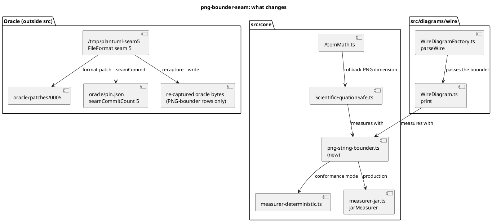

# Component map — png-bounder-seam

The files this mission writes and how they depend on each other. Verified to parse with the oracle jar at planning.

```plantuml
@startuml
title png-bounder-seam: what changes
package "Oracle (outside src)" {
  [/tmp/plantuml-seam5\nFileFormat seam 5] as fork
  [oracle/patches/0005] as patch
  [oracle/pin.json\nseamCommitCount 5] as pin
  [re-captured oracle bytes\n(PNG-bounder rows only)] as bytes
}
package "src/core" {
  [png-string-bounder.ts\n(new)] as pngb
  [measurer-deterministic.ts] as det
  [measurer-jar.ts\njarMeasurer] as jar
  [AtomMath.ts] as atom
  [ScientificEquationSafe.ts] as ses
}
package "src/diagrams/wire" {
  [WireDiagram.ts\nprint] as wire
  [WireDiagramFactory.ts\nparseWire] as factory
}
fork --> patch : format-patch
fork --> pin : seamCommit
fork --> bytes : recapture --write
pngb --> det : conformance mode
pngb --> jar : production
atom --> ses : rollback PNG dimension
ses --> pngb : measures with
factory --> wire : passes the bounder
wire --> pngb : measures with
@enduml
```
