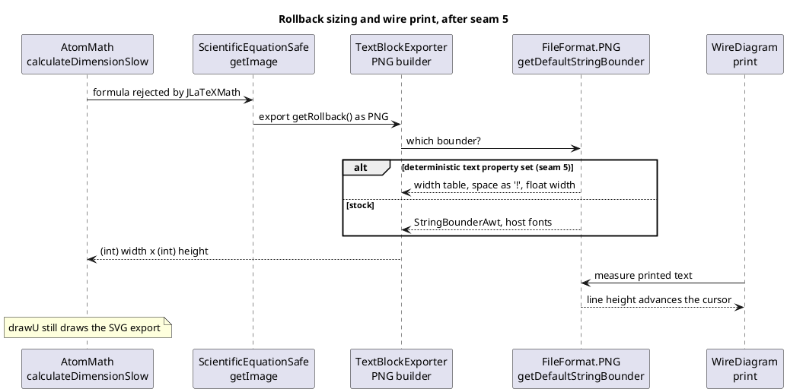

# Data flow — png-bounder-seam

How a rollback atom and a wire `print` reach `FileFormat.PNG`'s bounder after seam #5 (D1, D3 to D5). Verified to parse with the oracle jar at planning.

```plantuml
@startuml
title Rollback sizing and wire print, after seam 5
participant "AtomMath\ncalculateDimensionSlow" as atom
participant "ScientificEquationSafe\ngetImage" as ses
participant "TextBlockExporter\nPNG builder" as tbe
participant "FileFormat.PNG\ngetDefaultStringBounder" as png
participant "WireDiagram\nprint" as wire
atom -> ses : formula rejected by JLaTeXMath
ses -> tbe : export getRollback() as PNG
tbe -> png : which bounder?
alt deterministic text property set (seam 5)
  png --> tbe : width table, space as '!', float width
else stock
  png --> tbe : StringBounderAwt, host fonts
end
tbe --> atom : (int) width x (int) height
wire -> png : measure printed text
png --> wire : line height advances the cursor
note over atom : drawU still draws the SVG export
@enduml
```
