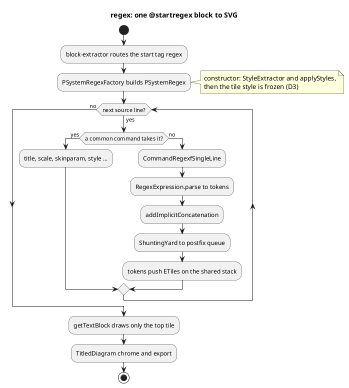

# Data flow

One `@startregex` block, from the start tag to the SVG. Rendered through the jar at planning (parses as ACTIVITY).

```plantuml
@startuml
title regex: one @startregex block to SVG
start
:block-extractor routes the start tag regex;
:PSystemRegexFactory builds PSystemRegex;
note right
constructor: StyleExtractor and applyStyles,
then the tile style is frozen (D3)
end note
while (next source line?) is (yes)
  if (a common command takes it?) then (yes)
    :title, scale, skinparam, style ...;
  else (no)
    :CommandRegexfSingleLine;
    :RegexExpression.parse to tokens;
    :addImplicitConcatenation;
    :ShuntingYard to postfix queue;
    :tokens push ETiles on the shared stack;
  endif
endwhile (no)
:getTextBlock draws only the top tile;
:TitledDiagram chrome and export;
stop
@enduml
```
