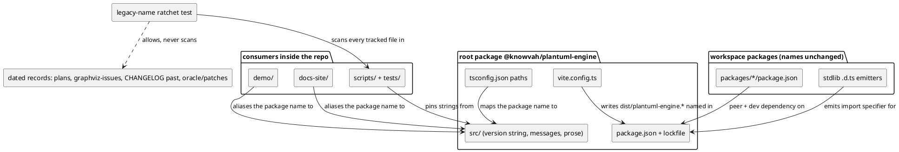

# Component map — what the rename touches

Every component that carries the package name, and who reads it. `ALLOWED` records are outside the sweep.

```plantuml
@startuml
skinparam componentStyle rectangle
package "root package @knowvah/plantuml-engine" {
  [package.json + lockfile] as PKG
  [vite.config.ts] as VITE
  [tsconfig.json paths] as TSC
  [src/ (version string, messages, prose)] as SRC
}
package "workspace packages (names unchanged)" {
  [packages/*/package.json] as WS
  [stdlib .d.ts emitters] as EMIT
}
package "consumers inside the repo" {
  [demo/] as DEMO
  [docs-site/] as SITE
  [scripts/ + tests/] as ST
}
[legacy-name ratchet test] as RATCHET
[dated records: plans, graphviz-issues, CHANGELOG past, oracle/patches] as REC

VITE --> PKG : writes dist/plantuml-engine.* named in
WS --> PKG : peer + dev dependency on
EMIT --> PKG : emits import specifier for
DEMO --> SRC : aliases the package name to
SITE --> SRC : aliases the package name to
TSC --> SRC : maps the package name to
ST --> SRC : pins strings from
RATCHET --> ST : scans every tracked file in
RATCHET ..> REC : allows, never scans
@enduml
```
