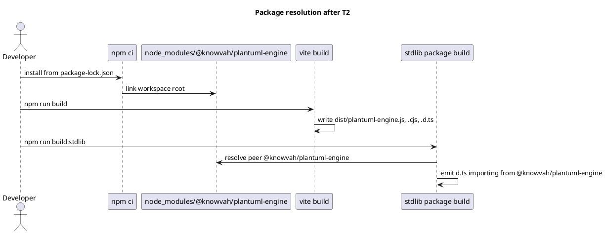
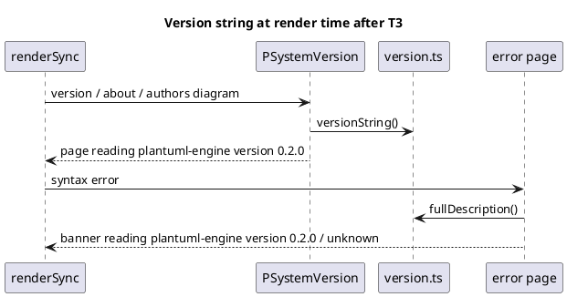

# Data flow — how the new name reaches each output

Two flows change: package resolution at build/install time, and the version string at render time.

```plantuml
@startuml
title Package resolution after T2
actor Developer
participant "npm ci" as NPM
participant "node_modules/@knowvah/plantuml-engine" as LINK
participant "vite build" as VITE
participant "stdlib package build" as STD
Developer -> NPM : install from package-lock.json
NPM -> LINK : link workspace root
Developer -> VITE : npm run build
VITE -> VITE : write dist/plantuml-engine.js, .cjs, .d.ts
Developer -> STD : npm run build:stdlib
STD -> LINK : resolve peer @knowvah/plantuml-engine
STD -> STD : emit d.ts importing from @knowvah/plantuml-engine
@enduml
```

```plantuml
@startuml
title Version string at render time after T3
participant "renderSync" as R
participant "PSystemVersion" as PV
participant "version.ts" as V
participant "error page" as E
R -> PV : version / about / authors diagram
PV -> V : versionString()
PV --> R : page reading plantuml-engine version 0.2.0
R -> E : syntax error
E -> V : fullDescription()
E --> R : banner reading plantuml-engine version 0.2.0 / unknown
@enduml
```
