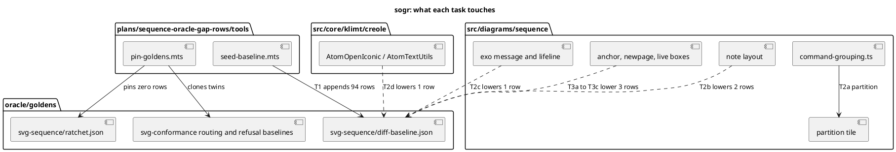

# Component map

```plantuml
@startuml
title sogr: what each task touches
package "plans/sequence-oracle-gap-rows/tools" {
  [seed-baseline.mts] as seed
  [pin-goldens.mts] as pin
}
package "oracle/goldens" {
  [svg-sequence/diff-baseline.json] as base
  [svg-sequence/ratchet.json] as ratchet
  [svg-conformance routing and refusal baselines] as twins
}
package "src/diagrams/sequence" {
  [command-grouping.ts] as grp
  [partition tile] as part
  [note layout] as notes
  [exo message and lifeline] as exo
  [anchor, newpage, live boxes] as geo
}
package "src/core/klimt/creole" {
  [AtomOpenIconic / AtomTextUtils] as icon
}
seed --> base : T1 appends 94 rows
pin --> ratchet : pins zero rows
pin --> twins : clones twins
grp --> part : T2a partition
notes ..> base : T2b lowers 2 rows
exo ..> base : T2c lowers 1 row
icon ..> base : T2d lowers 1 row
geo ..> base : T3a to T3c lower 3 rows
@enduml
```
