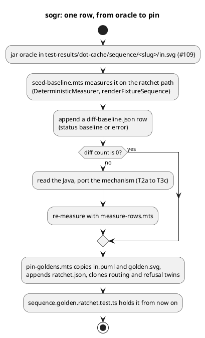

# Data flow: how a #109 row becomes a held pin

```plantuml
@startuml
title sogr: one row, from oracle to pin
start
:jar oracle in test-results/dot-cache/sequence/<slug>/in.svg (#109);
:seed-baseline.mts measures it on the ratchet path\n(DeterministicMeasurer, renderFixtureSequence);
:append a diff-baseline.json row\n(status baseline or error);
if (diff count is 0?) then (yes)
else (no)
  :read the Java, port the mechanism (T2a to T3c);
  :re-measure with measure-rows.mts;
endif
:pin-goldens.mts copies in.puml and golden.svg,\nappends ratchet.json, clones routing and refusal twins;
:sequence.golden.ratchet.test.ts holds it from now on;
stop
@enduml
```
