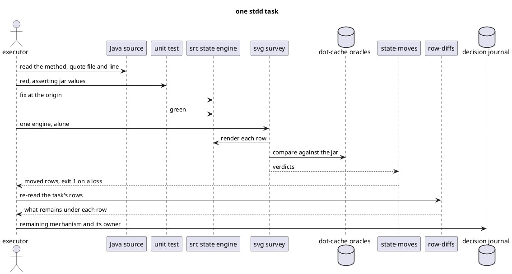

# Data flow — one task's loop (proposed)

```plantuml
@startuml
title one stdd task
actor "executor" as EX
participant "Java source" as JV
participant "unit test" as UT
participant "src state engine" as SE
participant "svg survey" as SU
database "dot-cache oracles" as CA
participant "state-moves" as SM
participant "row-diffs" as RD
database "decision journal" as DJ

EX -> JV : read the method, quote file and line
EX -> UT : red, asserting jar values
EX -> SE : fix at the origin
UT -> SE : green
EX -> SU : one engine, alone
SU -> SE : render each row
SU -> CA : compare against the jar
SU --> SM : verdicts
SM --> EX : moved rows, exit 1 on a loss
EX -> RD : re-read the task's rows
RD --> EX : what remains under each row
EX -> DJ : remaining mechanism and its owner
@enduml
```
