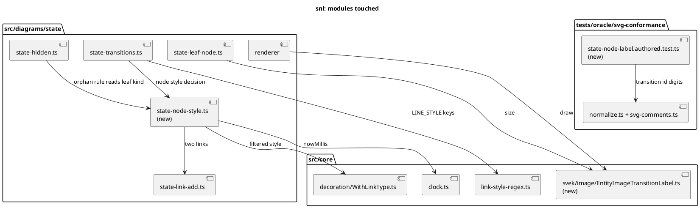

# Component map

```plantuml
@startuml
title snl: modules touched
package "src/core" {
  [link-style-regex.ts] as LSR
  [decoration/WithLinkType.ts] as WLT
  [svek/image/EntityImageTransitionLabel.ts\n(new)] as ETL
  [clock.ts] as CLK
}
package "src/diagrams/state" {
  [state-transitions.ts] as ST
  [state-node-style.ts\n(new)] as SNS
  [state-link-add.ts] as SLA
  [state-hidden.ts] as SH
  [state-leaf-node.ts] as SLN
  [renderer] as REN
}
package "tests/oracle/svg-conformance" {
  [normalize.ts + svg-comments.ts] as NRM
  [state-node-label.authored.test.ts\n(new)] as GATE
}
ST --> LSR : LINE_STYLE keys
ST --> SNS : node style decision
SNS --> CLK : nowMillis
SNS --> SLA : two links
SNS --> WLT : filtered style
SH --> SNS : orphan rule reads leaf kind
SLN --> ETL : size
REN --> ETL : draw
GATE --> NRM : transition id digits
@enduml
```
