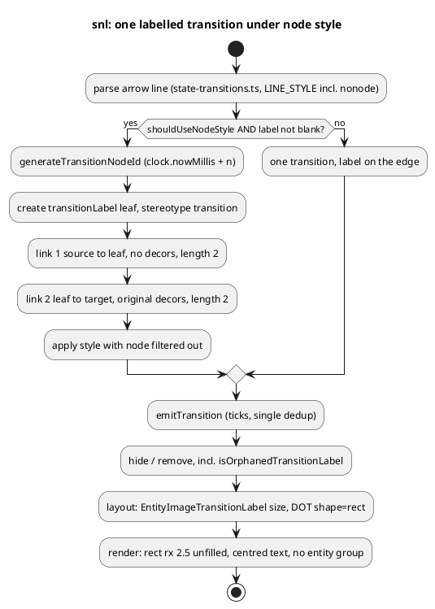

# Data flow: a node-style transition

```plantuml
@startuml
title snl: one labelled transition under node style
start
:parse arrow line (state-transitions.ts, LINE_STYLE incl. nonode);
if (shouldUseNodeStyle AND label not blank?) then (yes)
  :generateTransitionNodeId (clock.nowMillis + n);
  :create transitionLabel leaf, stereotype transition;
  :link 1 source to leaf, no decors, length 2;
  :link 2 leaf to target, original decors, length 2;
  :apply style with node filtered out;
else (no)
  :one transition, label on the edge;
endif
:emitTransition (ticks, single dedup);
:hide / remove, incl. isOrphanedTransitionLabel;
:layout: EntityImageTransitionLabel size, DOT shape=rect;
:render: rect rx 2.5 unfilled, centred text, no entity group;
stop
@enduml
```
