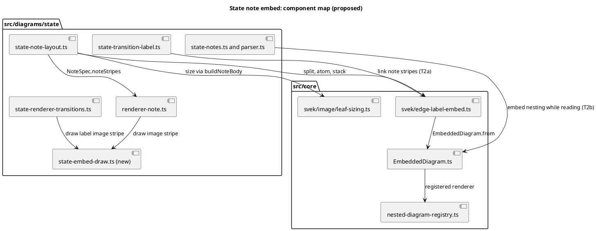

# Component map

Modules this mission touches (proposed), and the core helpers it reuses from ele (#144).

```plantuml
@startuml
title State note embed: component map (proposed)
package "src/core" {
  [svek/edge-label-embed.ts] as ELE
  [EmbeddedDiagram.ts] as ED
  [nested-diagram-registry.ts] as REG
  [svek/image/leaf-sizing.ts] as LS
}
package "src/diagrams/state" {
  [state-note-layout.ts] as NL
  [renderer-note.ts] as RN
  [state-embed-draw.ts (new)] as SED
  [state-renderer-transitions.ts] as SRT
  [state-transition-label.ts] as STL
  [state-notes.ts and parser.ts] as SN
}
NL --> LS : size via buildNoteBody
NL --> ELE : split, atom, stack
ELE --> ED : EmbeddedDiagram.from
ED --> REG : registered renderer
NL --> RN : NoteSpec.noteStripes
RN --> SED : draw image stripe
SRT --> SED : draw label image stripe
STL --> ELE : link note stripes (T2a)
SN --> ED : embed nesting while reading (T2b)
@enduml
```
