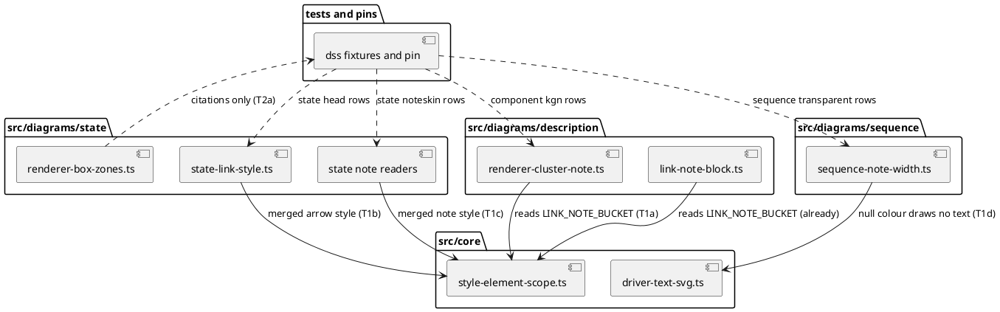

# Component map

The modules each task touches, and the shared pieces they read. Proposed state.

```plantuml
@startuml
package "src/core" {
  [style-element-scope.ts] as SES
  [driver-text-svg.ts] as DTS
}
package "src/diagrams/description" {
  [renderer-cluster-note.ts] as RCN
  [link-note-block.ts] as LNB
}
package "src/diagrams/state" {
  [state-link-style.ts] as SLS
  [state note readers] as SNR
  [renderer-box-zones.ts] as RBZ
}
package "src/diagrams/sequence" {
  [sequence-note-width.ts] as SNW
}
package "tests and pins" {
  [dss fixtures and pin] as PIN
}

RCN --> SES : reads LINK_NOTE_BUCKET (T1a)
LNB --> SES : reads LINK_NOTE_BUCKET (already)
SLS --> SES : merged arrow style (T1b)
SNR --> SES : merged note style (T1c)
SNW --> DTS : null colour draws no text (T1d)
RBZ ..> PIN : citations only (T2a)
PIN ..> RCN : component kgn rows
PIN ..> SLS : state head rows
PIN ..> SNR : state noteskin rows
PIN ..> SNW : sequence transparent rows
@enduml
```
