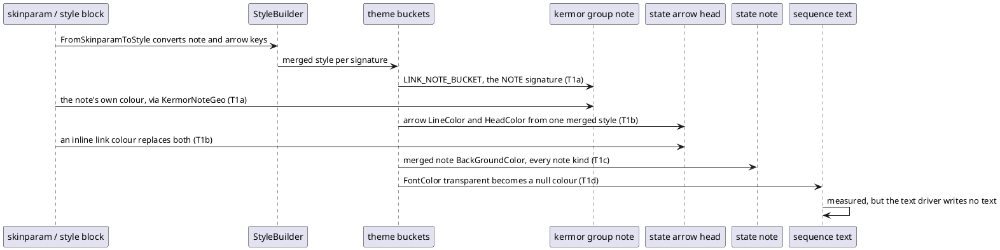

# Data flow

How a colour declared in the source reaches each of the four open draws. Proposed state (after batch 1).

```plantuml
@startuml
participant "skinparam / style block" as SRC
participant "StyleBuilder" as SB
participant "theme buckets" as TB
participant "kermor group note" as KGN
participant "state arrow head" as SAH
participant "state note" as SN
participant "sequence text" as SEQ

SRC -> SB : FromSkinparamToStyle converts note and arrow keys
SB -> TB : merged style per signature
TB -> KGN : LINK_NOTE_BUCKET, the NOTE signature (T1a)
SRC -> KGN : the note's own colour, via KermorNoteGeo (T1a)
TB -> SAH : arrow LineColor and HeadColor from one merged style (T1b)
SRC -> SAH : an inline link colour replaces both (T1b)
TB -> SN : merged note BackGroundColor, every note kind (T1c)
TB -> SEQ : FontColor transparent becomes a null colour (T1d)
SEQ -> SEQ : measured, but the text driver writes no text
@enduml
```
