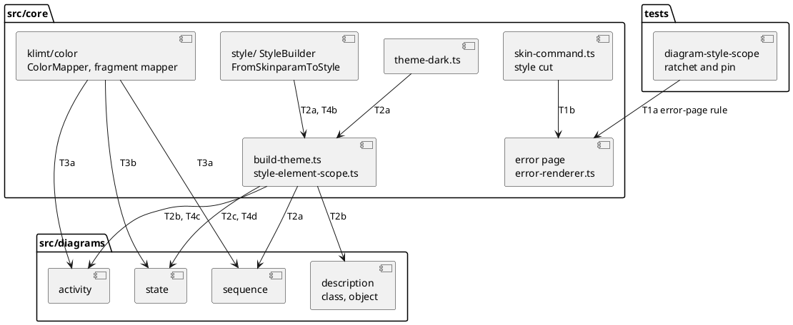

# Component map: what each batch touches

```plantuml
@startuml
package "src/core" {
  [skin-command.ts\nstyle cut] as cut
  [style/ StyleBuilder\nFromSkinparamToStyle] as style
  [build-theme.ts\nstyle-element-scope.ts] as theme
  [theme-dark.ts] as dark
  [klimt/color\nColorMapper, fragment mapper] as mapper
  [error page\nerror-renderer.ts] as err
}
package "src/diagrams" {
  [sequence] as seq
  [description\nclass, object] as desc
  [activity] as act
  [state] as st
}
package "tests" {
  [diagram-style-scope\nratchet and pin] as pin
}
cut --> err : T1b
style --> theme : T2a, T4b
dark --> theme : T2a
theme --> seq : T2a
theme --> desc : T2b
theme --> act : T2b, T4c
theme --> st : T2c, T4d
mapper --> act : T3a
mapper --> seq : T3a
mapper --> st : T3b
pin --> err : T1a error-page rule
@enduml
```
