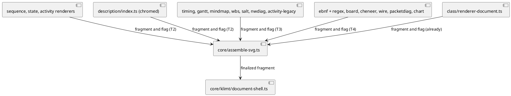

# Component map

Which producer each task changes, and the shared shell they all reach.

```plantuml
@startuml
component "sequence, state, activity renderers" as T2
component "description/index.ts (chromed)" as T2d
component "timing, gantt, mindmap, wbs, salt, nwdiag, activity-legacy" as T3
component "ebnf + regex, board, cheneer, wire, packetdiag, chart" as T4
component "class/renderer-document.ts" as CLS
component "core/assemble-svg.ts" as ASM
component "core/klimt/document-shell.ts" as SHELL
T2 --> ASM : fragment and flag (T2)
T2d --> ASM : fragment and flag (T2)
T3 --> ASM : fragment and flag (T3)
T4 --> ASM : fragment and flag (T4)
CLS --> ASM : fragment and flag (already)
ASM --> SHELL : finalized fragment
@enduml
```
