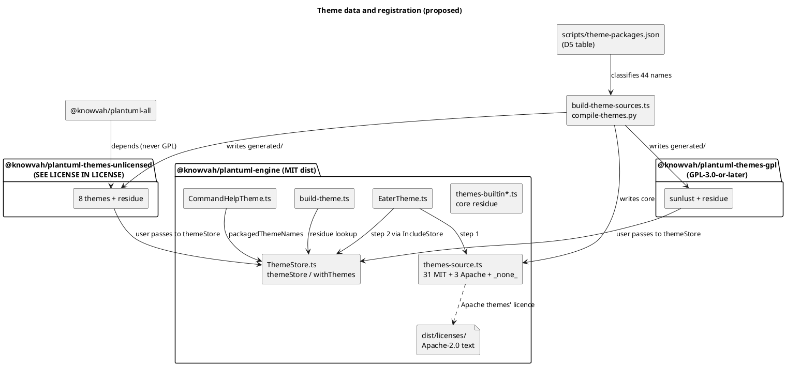

# Component map — where the theme data lives after this mission

```plantuml
@startuml
title Theme data and registration (proposed)
skinparam componentStyle rectangle

package "@knowvah/plantuml-engine (MIT dist)" {
  component "themes-source.ts\n31 MIT + 3 Apache + _none_" as SRC
  component "themes-builtin*.ts\ncore residue" as RES
  component "ThemeStore.ts\nthemeStore / withThemes" as TS
  component "EaterTheme.ts" as ET
  component "build-theme.ts" as BT
  component "CommandHelpTheme.ts" as HELP
  file "dist/licenses/\nApache-2.0 text" as LIC
}

package "@knowvah/plantuml-themes-unlicensed\n(SEE LICENSE IN LICENSE)" {
  component "8 themes + residue" as UNL
}
package "@knowvah/plantuml-themes-gpl\n(GPL-3.0-or-later)" {
  component "sunlust + residue" as GPL
}
component "@knowvah/plantuml-all" as ALL
component "scripts/theme-packages.json\n(D5 table)" as TBL
component "build-theme-sources.ts\ncompile-themes.py" as GEN

GEN --> SRC : writes core
GEN --> UNL : writes generated/
GEN --> GPL : writes generated/
TBL --> GEN : classifies 44 names
UNL --> TS : user passes to themeStore
GPL --> TS : user passes to themeStore
ALL --> UNL : depends (never GPL)
ET --> SRC : step 1
ET --> TS : step 2 via IncludeStore
BT --> TS : residue lookup
HELP --> TS : packagedThemeNames
SRC ..> LIC : Apache themes' licence
@enduml
```
