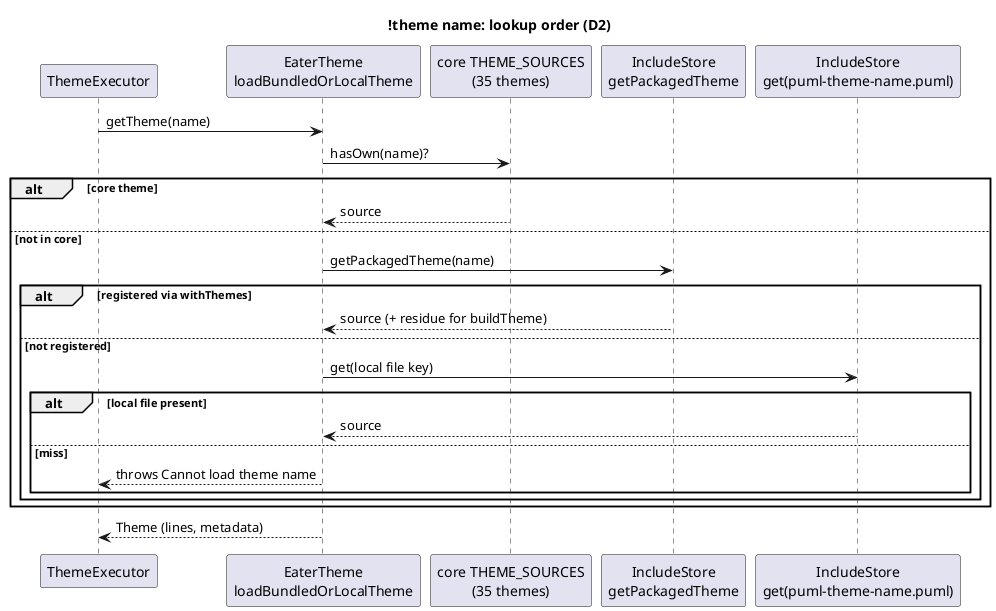

# Data flow — resolving `!theme <name>` after this mission

```plantuml
@startuml
title !theme name: lookup order (D2)
participant "ThemeExecutor" as TE
participant "EaterTheme\nloadBundledOrLocalTheme" as ET
participant "core THEME_SOURCES\n(35 themes)" as CORE
participant "IncludeStore\ngetPackagedTheme" as PKG
participant "IncludeStore\nget(puml-theme-name.puml)" as LOCAL

TE -> ET : getTheme(name)
ET -> CORE : hasOwn(name)?
alt core theme
  CORE --> ET : source
else not in core
  ET -> PKG : getPackagedTheme(name)
  alt registered via withThemes
    PKG --> ET : source (+ residue for buildTheme)
  else not registered
    ET -> LOCAL : get(local file key)
    alt local file present
      LOCAL --> ET : source
    else miss
      ET --> TE : throws Cannot load theme name
    end
  end
end
ET --> TE : Theme (lines, metadata)
@enduml
```

`help themes` lists core names plus `packagedThemeNames()`, which `parseOptionsOf` forwards (D3).
