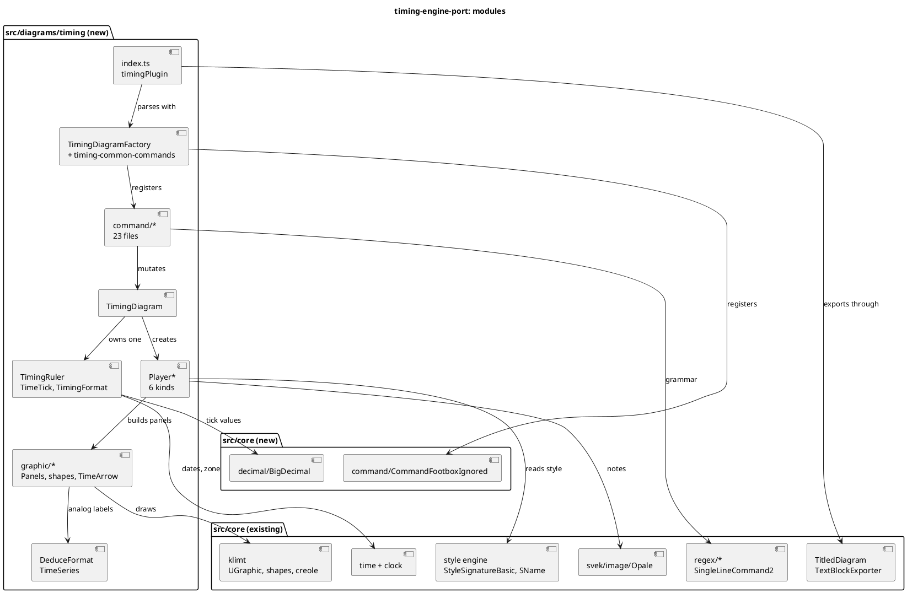

# Component map

New modules (this mission) and the existing ones they import. One arrow per dependency kind, labelled.

```plantuml
@startuml
title timing-engine-port: modules
package "src/diagrams/timing (new)" {
  [index.ts\ntimingPlugin] as IDX
  [TimingDiagramFactory\n+ timing-common-commands] as FAC
  [command/*\n23 files] as CMD
  [TimingDiagram] as TD
  [TimingRuler\nTimeTick, TimingFormat] as RUL
  [Player*\n6 kinds] as PL
  [graphic/*\nPanels, shapes, TimeArrow] as GR
  [DeduceFormat\nTimeSeries] as DF
}
package "src/core (existing)" {
  [TitledDiagram\nTextBlockExporter] as TDX
  [klimt\nUGraphic, shapes, creole] as KL
  [style engine\nStyleSignatureBasic, SName] as ST
  [time + clock] as TM
  [svek/image/Opale] as OP
  [regex/*\nSingleLineCommand2] as RX
}
package "src/core (new)" {
  [decimal/BigDecimal] as BD
  [command/CommandFootboxIgnored] as FB
}
IDX --> FAC : parses with
IDX --> TDX : exports through
FAC --> CMD : registers
FAC --> FB : registers
CMD --> RX : grammar
CMD --> TD : mutates
TD --> RUL : owns one
TD --> PL : creates
PL --> GR : builds panels
GR --> KL : draws
GR --> DF : analog labels
PL --> OP : notes
PL --> ST : reads style
RUL --> BD : tick values
RUL --> TM : dates, zone
@enduml
```
