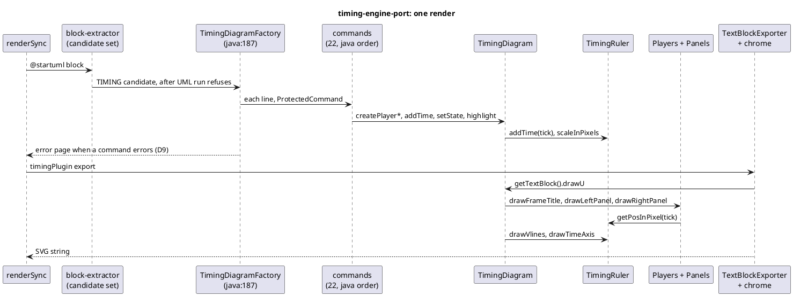

# Data flow

A `@startuml` source the jar types `TIMING`, from text to SVG, after T4a. Dispatch tries the UML run first; timing
claims only what every earlier factory refuses (D10).

```plantuml
@startuml
title timing-engine-port: one render
participant "renderSync" as R
participant "block-extractor\n(candidate set)" as B
participant "TimingDiagramFactory\n(java:187)" as F
participant "commands\n(22, java order)" as C
participant "TimingDiagram" as D
participant "TimingRuler" as T
participant "Players + Panels" as P
participant "TextBlockExporter\n+ chrome" as X
R -> B : @startuml block
B -> F : TIMING candidate, after UML run refuses
F -> C : each line, ProtectedCommand
C -> D : createPlayer*, addTime, setState, highlight
D -> T : addTime(tick), scaleInPixels
F --> R : error page when a command errors (D9)
R -> X : timingPlugin export
X -> D : getTextBlock().drawU
D -> P : drawFrameTitle, drawLeftPanel, drawRightPanel
P -> T : getPosInPixel(tick)
D -> T : drawVlines, drawTimeAxis
X --> R : SVG string
@enduml
```
