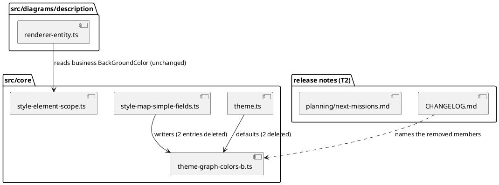

# Component map: what T1a and T2 touch

```plantuml
@startuml
package "src/core" {
  [theme-graph-colors-b.ts] as T
  [theme.ts] as TH
  [style-map-simple-fields.ts] as S
  [style-element-scope.ts] as E
}
package "src/diagrams/description" {
  [renderer-entity.ts] as R
}
package "release notes (T2)" {
  [CHANGELOG.md] as C
  [planning/next-missions.md] as N
}
TH --> T : defaults (2 deleted)
S --> T : writers (2 entries deleted)
R --> E : reads business BackGroundColor (unchanged)
C ..> T : names the removed members
@enduml
```
