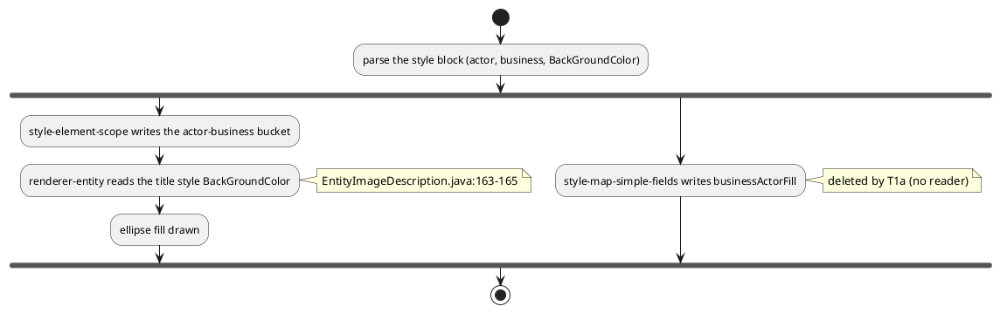

# Data flow: a business symbol's fill, after T1a

The fill already came from the style signature before this mission; T1a removes the side path that wrote two theme
fields nobody read.

```plantuml
@startuml
start
:parse the style block (actor, business, BackGroundColor);
fork
  :style-element-scope writes the actor-business bucket;
  :renderer-entity reads the title style BackGroundColor;
  note right: EntityImageDescription.java:163-165
  :ellipse fill drawn;
fork again
  :style-map-simple-fields writes businessActorFill;
  note right: deleted by T1a (no reader)
end fork
stop
@enduml
```
