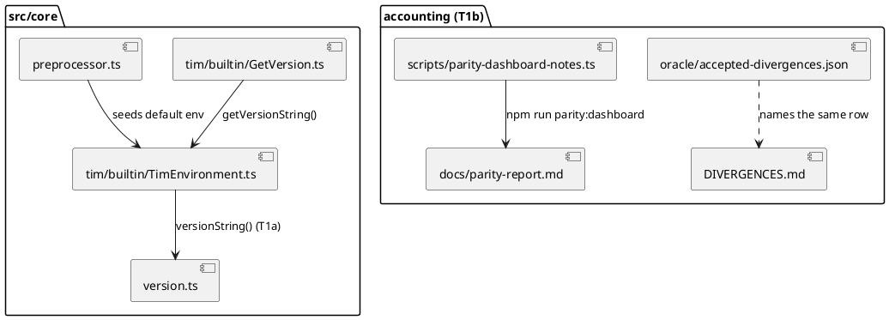

# Component map: what T1a and T1b touch

```plantuml
@startuml
package "src/core" {
  [version.ts] as V
  [tim/builtin/TimEnvironment.ts] as E
  [tim/builtin/GetVersion.ts] as G
  [preprocessor.ts] as P
}
package "accounting (T1b)" {
  [oracle/accepted-divergences.json] as L
  [DIVERGENCES.md] as D
  [scripts/parity-dashboard-notes.ts] as N
  [docs/parity-report.md] as R
}
P --> E : seeds default env
G --> E : getVersionString()
E --> V : versionString() (T1a)
N --> R : npm run parity:dashboard
L ..> D : names the same row
@enduml
```
