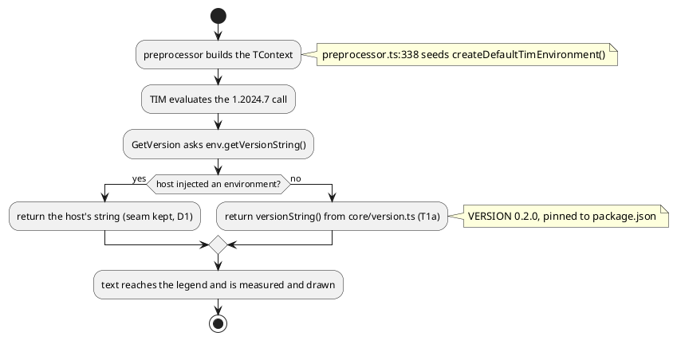

# Data flow: `%version()`, after T1a

Before the mission the default environment answered `'unknown'`. After T1a it answers `versionString()`, the same
value the error and `version` pages print.

```plantuml
@startuml
start
:preprocessor builds the TContext;
note right: preprocessor.ts:338 seeds createDefaultTimEnvironment()
:TIM evaluates the %version() call;
:GetVersion asks env.getVersionString();
if (host injected an environment?) then (yes)
  :return the host's string (seam kept, D1);
else (no)
  :return versionString() from core/version.ts (T1a);
  note right: VERSION 0.2.0, pinned to package.json
endif
:text reaches the legend and is measured and drawn;
stop
@enduml
```
