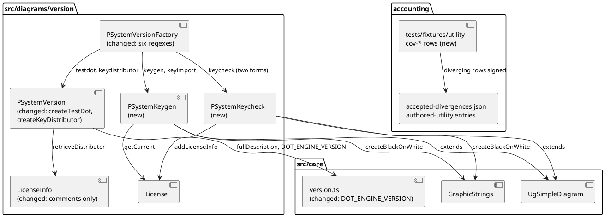

# Component map

New components are marked `new`; changed ones `changed`. Nothing outside `src/diagrams/version/` and
`src/core/version.ts` changes in `src/`.

```plantuml
@startuml
package "src/diagrams/version" {
  component "PSystemVersionFactory\n(changed: six regexes)" as factory
  component "PSystemVersion\n(changed: createTestDot,\ncreateKeyDistributor)" as version
  component "PSystemKeygen\n(new)" as keygen
  component "PSystemKeycheck\n(new)" as keycheck
  component "License" as license
  component "LicenseInfo\n(changed: comments only)" as info
}
package "src/core" {
  component "version.ts\n(changed: DOT_ENGINE_VERSION)" as coreversion
  component "UgSimpleDiagram" as ug
  component "GraphicStrings" as gs
}
package "accounting" {
  component "tests/fixtures/utility\ncov-* rows (new)" as rows
  component "accepted-divergences.json\nauthored-utility entries" as ledger
}

factory --> version : testdot, keydistributor
factory --> keygen : keygen, keyimport
factory --> keycheck : keycheck (two forms)
version --> coreversion : fullDescription, DOT_ENGINE_VERSION
version --> info : retrieveDistributor
keygen --> ug : extends
keycheck --> ug : extends
keygen --> gs : createBlackOnWhite
keycheck --> gs : createBlackOnWhite
keygen --> license : getCurrent
keycheck --> license : addLicenseInfo
rows --> ledger : diverging rows signed
@enduml
```
