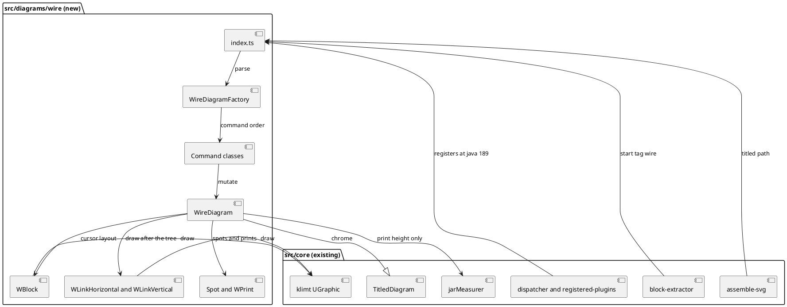

# Component map

```plantuml
@startuml
package "src/diagrams/wire (new)" {
  [index.ts] as index
  [WireDiagramFactory] as factory
  [Command classes] as commands
  [WireDiagram] as diagram
  [WBlock] as block
  [WLinkHorizontal and WLinkVertical] as links
  [Spot and WPrint] as marks
}
package "src/core (existing)" {
  [dispatcher and registered-plugins] as dispatch
  [block-extractor] as extractor
  [assemble-svg] as assemble
  [TitledDiagram] as titled
  [klimt UGraphic] as klimt
  [jarMeasurer] as awt
}
dispatch --> index : registers at java 189
extractor --> index : start tag wire
index --> factory : parse
factory --> commands : command order
commands --> diagram : mutate
diagram --> block : cursor layout
diagram --> links : draw after the tree
diagram --> marks : spots and prints
diagram --> awt : print height only
diagram --|> titled : chrome
block --> klimt : draw
links --> klimt : draw
assemble --> index : titled path
@enduml
```
