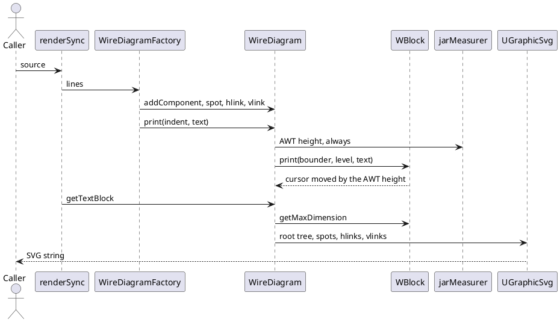

# Data flow — a `@startwire` render

The `print` step is the one place the render's measurer is not used (D3).

```plantuml
@startuml
actor Caller
participant renderSync
participant WireDiagramFactory
participant WireDiagram
participant WBlock
participant jarMeasurer
participant UGraphicSvg

Caller -> renderSync : source
renderSync -> WireDiagramFactory : lines
WireDiagramFactory -> WireDiagram : addComponent, spot, hlink, vlink
WireDiagramFactory -> WireDiagram : print(indent, text)
WireDiagram -> jarMeasurer : AWT height, always
WireDiagram -> WBlock : print(bounder, level, text)
WBlock --> WireDiagram : cursor moved by the AWT height
renderSync -> WireDiagram : getTextBlock
WireDiagram -> WBlock : getMaxDimension
WireDiagram -> UGraphicSvg : root tree, spots, hlinks, vlinks
UGraphicSvg --> Caller : SVG string
@enduml
```
